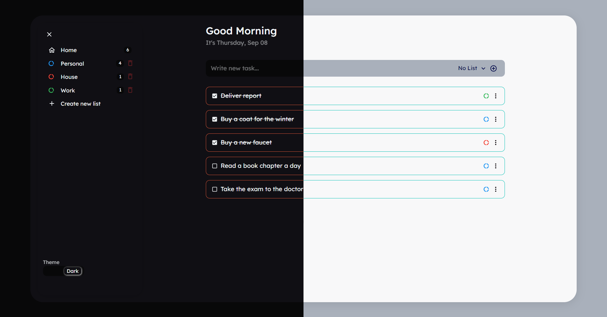

# Todo List

## About

Todo list developed with ReactJS and Firebase.

Site: [todo.empthy.dev/](https://todo.empthy.dev/)
 
 

## Features

- Add/Delete/Edit Item in list.
- Theme Swicther.
- Checkbox item.
- Create/Delete category.

 

 
 

# Tech Stack

- Typescript
- ReactJS
- Material UI (MUI)
- Luxon
- Firebase

 

### Author

Nathan Stabille

https://www.linkedin.com/in/nathan-stabille

https://nathanstabille.vercel.app/
